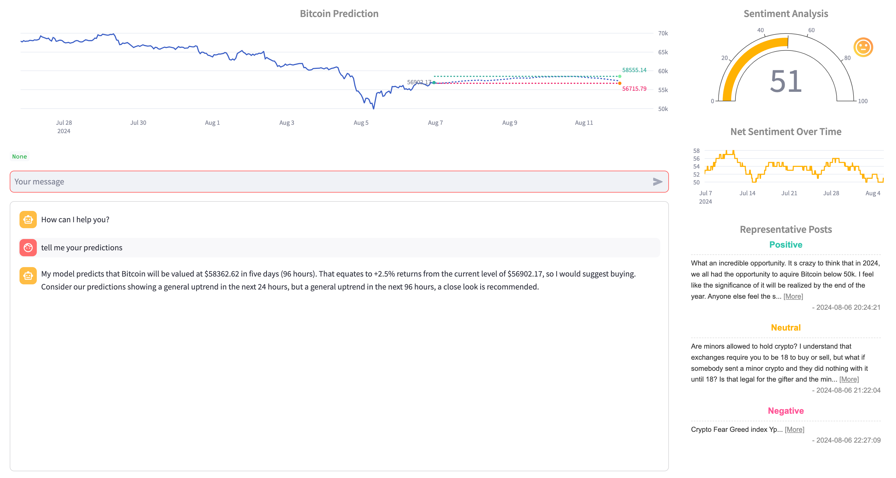
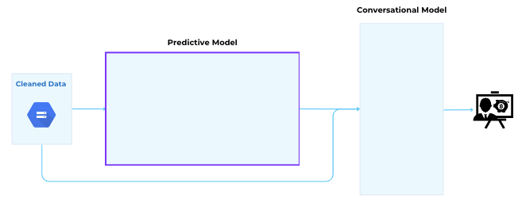
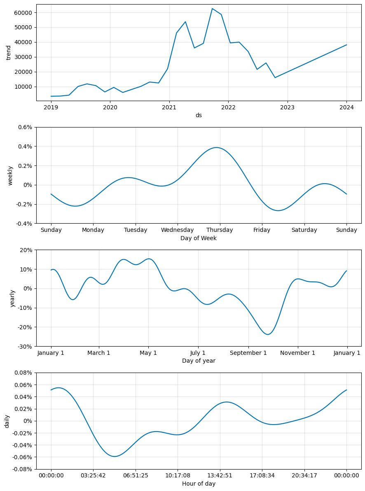

  

<h1 align="center">

<a href="https://eniquego.com/" target="_blank">Autonomous Investment Advisor</a>

</h1>

Enique is a conversational AI investment advisor integrated with a proprietary price prediction model. Enique runs autonomously in real-time.

    
 

  
## Problem Statement
**Background:** As of 1Q24, the portion of total household wealth made up of financial assets is ~68% -- of which ~40% is invested in corporate equities; and, two-thirds of people across the world invest in the markets. These retail (vs. institutional) investors often need more hands-on guidance on how to aptly invest. 

Providing services to such a large number of different individuals at the quality expected in today's world is a challenge that is inefficiently managed. This failure of existing methods to meet client standards have left many non-financial experts under-serviced. 

**Target Audience**: 
Enique focuses on individuals who may not have substantial savings but are eager to generate passive income to enjoy life's simple pleasures.

**Challenges**: Navigating the financial landscape is daunting and time-consuming, even for industry professionals. Outsourcing investment advice is costly and largely inaccessible to our target users. Playing the safe, conservative long game does not yield significant immediate-term profits, which is a primary concern for our audience.

**Enique's business value begins by addressing these pain points.**

## Business Value
**Enique’s capabilities surpass those of typical human investment advisors.**

    
 

 
**Pains of Human Services**: Human investment advisors provide financial guidance based on standardized strategies and second-hand research. They cannot customize or generate ad-hoc analyses upon request. Additionally, their fee structures are not worthwhile for individuals with smaller deposits.

**Enique's Capabilities**
- **Customized Strategies**: Enique delivers specific investment strategies based on its proprietary market predictions.
- **Plug-and-Play Tool**: Enique can seamlessly integrate any in-house proprietary prediction model, enhancing offerings for downstream clients. 
  - To illustrate this concretely, our team has developed a *Bitcoin prediction model* integrated as the default within Enique. 
  - We feel there is a significant opportunity in this asset, which we will delve into more later. 
- Enique performs **bespoke research on-the-fly**, leveraging its computational power to address client queries immediately.
- Enique’s prediction models **adapt in real time** by directly integrating **live data**.
- Enique is available 24/7, with no fees, and is deposit size agnostic, making it accessible to all income levels.

These business values create earning opportunities, foster intellectual growth, and are cost-efficient in terms of money and time. Hence our motto...

**More earning and learning; less spending and tending.**

## Technical Sophistication and Efficiency

### Package Requirements

-   OS: Debian 11
-   Python: 3.10.14; 3.11.2
-   Numpy: 1.25.2
-   Sklearn: 1.3.0
-   Tensorflow: 2.13.0; 2.14.0
-   Keras: 2.8; 2.14.0
-   Hadoop: 3.3
-   Spark: 3.3
-   Spark-nlp: 4.2.0
-   Prophet: 1.1.5
-   Streamlit: 1.34.0
  
###  Data and Processing Overview

    
 

#### Data Sources
  - **Bitcoin Market Data**: Sourced from Binance, including prices and trade volume.
  - **Reddit Blog Posts**: Sourced to proxy sentiment for our prediction model.

#### Data Ingestion and Processing
- **Bitcoin Data**: Prices and trade volume are ingested hourly, cleaned, and processed.
- **Reddit Data**:
  - Reddit API limits pull to the last 1000 observations. As post reactions such as upvotes, downvotes, and comments change over time, our API pulls data every fifteen minutes.
  - Processing logic updates overlapping Reddit data with the latest reaction metrics.
  - Focuses on text submissions from the subreddit “r/bitcoin,” excluding gifs, videos, and links.
  - Data is cleaned and filtered through zero-shot learning. 
  
- **Historical Data of Five Years**
  - Bitcoin trade data (last five years, approx. 9.7 MB) and Reddit data (approx. 2.4 TB) are processed using Spark to handle large data sizes.

#### Raw Sentiment Scores

- Surviving Reddit posts are processed using a pre-trained three-category sentiment model to assign positive, negative, and neutral sentiment scores. These are further engineered into creating unique features.

##### Data Management:

<table class="tg"><thead>
  <tr>
    <th class="tg-1wig">Scheduler Name</th>
    <th class="tg-1wig">Frequency</th>
    <th class="tg-1wig">Cron Format</th>
    <th class="tg-1wig">Note</th>
  </tr></thead>
<tbody>
  <tr>
    <td class="tg-0lax">get-reddit-data</td>
    <td class="tg-0lax">Every 15 mins</td>
    <td class="tg-0lax">*/15 * * * *</td>
    <td class="tg-0lax">
      1. Get and save the raw data;  
      2. Add md5(content)  
      3. Set secret key as an env variable of get-reddit-data-func   

   </td>
  </tr>
  <tr>
    <td class="tg-0lax">discard-irrelevant-data</td>
    <td class="tg-0lax">Every 30 mins</td>
    <td class="tg-0lax">*/30 * * * *</td>
    <td class="tg-0lax">Combine reddit data, and conduct irrelevancy analysis</td>
  </tr>

  <tr>
    <td class="tg-0lax">sentiment-analysis</td>
    <td class="tg-0lax">Every 30 mins</td>
    <td class="tg-0lax">*/30 * * * *</td>
    <td class="tg-0lax">Sentiment analysis</td>
  </tr>
  <tr>
    <td class="tg-0lax">get-btc-data</td>
    <td class="tg-0lax">Every 1 hour</td>
    <td class="tg-0lax">0 * * * *</td>
    <td class="tg-0lax">Get BTC data from Binance</td>
  </tr>
  <tr>
    <td class="tg-0lax">process-btc-data</td>
    <td class="tg-0lax">Every 1 hour</td>
    <td class="tg-0lax">0 * * * *</td>
    <td class="tg-0lax">Calculate all the indicators and other features for modeling</td>
  </tr>
  <tr>
    <td class="tg-0lax">get-rep-posts</td>
    <td class="tg-0lax">Every 30 mins</td>
    <td class="tg-0lax">*/30 * * * *</td>
    <td class="tg-0lax">Get representative posts</td>
  </tr>
  <tr>
    <td class="tg-0lax">get-senti-indicators</td>
    <td class="tg-0lax">Every 30 mins</td>
    <td class="tg-0lax">*/30 * * * *</td>
    <td class="tg-0lax">Calculate sentiment indicators</td>
  </tr>
</tbody></table>

##### Storage and Scalability:
- All processed data is stored in Google Cloud Storage Buckets.
- Designed for scalability and flexibility to integrate new enhancements and additional data sources.
- Capable of extracting trend analytics and enriching prediction model inputs to expand advisory offerings.
- Flexible enough to integrate with third-party models for easy platform integration.

### Data Trend

**Exploratory Analysis:**
- We conducted an extensive exploratory analysis available in our GitHub repository. *Reference 04_EDA.*

**Quick Preview**
Across our Reddit data, blog post frequency was predictably higher during "normal business" hours, with a notable local spike at 2 am. This spike is likely due to nocturnal users like people sacrificing sleep for late-night exploration.
 

    
 

**Comparison with Bitcoin Trading Volume:**
- Comparing the shape of Reddit post activity to the average Bitcoin trade volume bar chart (top right in purple), we observe a significant overlap in Bitcoin trading volume (also shown in purple).
- This comparison is a basic sanity check if we use Reddit data to build sentiment signals for predicting Bitcoin prices.

    
 

**Bitcoin vs. S&P500 Trading Volumes:**
- Bitcoin trading volumes, compared to S&P500-related trading volumes shown in red, indicate that Bitcoin does not follow traditional market open and close concentrations.

    
 

**Earnings Opportunity:**
- The final chart demonstrates that the earnings opportunity for Bitcoin is much more significant due to its higher volatility. However, the risk-adjusted returns could be more attractive.

#### Data Challenges

This data processing was one of the most difficult challenges our team faced. Despite being popular subjects, bitcoin and reddit data sources often require paid subscriptions for live and full information. On the other hand, historical data sources could be found rather easily but posed great adversities in handling such big data. Successfully processing all the historical reddit data took several weeks within our alloted Capstone project time. We learned much about using Spark and other big data tools to overcome this hurdle.

###  Model Framework

Our ultimate goal is to provide actionable investment advice to the average person—the little guy who lacks extensive financial knowledge. Achieving this involves two main components: having our market prediction and conversing with the user to communicate relevant model findings and analyses.

Our model framework has two macro-categories of models: **predictive** and **conversational**.

    
 

#### Predictive Modeling

**Layers of Prediction Models:**

1. **Baseline Prophet Model:**

    
 

  Overview:
    - The first layer of prediction is our baseline Prophet model, which captures systematic price patterns driven by investor habits, such as the tendency to buy or sell trades at certain times.
    - During training, we input various combinations of engineered features as regressors, but none were notably beneficial at this stage.
    - Outputs include *baseline price, trend, seasonality, and a prediction residual*.

  Performance Results:
    - TO DOOOO !!!!!!!!!!!!!!!!!!!!!!!

  Analysis:
    - Look at how much the actual Bitcoin price (in black) deviates from the modeled price in blue. It’s clearly difficult to balance overfitting vs. capturing such volatile price action. 
    - Yet rather than asking what regressors can we add, what if we accept that baseline trend as fact. And instead, try to capture that remaining residual – in other words, the deviation of bitcoin actual prices from baseline trends. 

2. **Sentiment Neural Network:**

    
 

  
  Overview:
    - The second model takes the Prophet model's outputs and mixes them with new signals, including sentiment indicators and trade technicals.
    - The LSTM transformation deciphers the complex relationship between sentiment, price, and time, causing Bitcoin prices to deviate from baseline trends.

  Form

    
 

**Why Focus on Bitcoin:**
- Unlike traditional equities, Bitcoin has little to no fundamental valuation and is driven by technical factors and essentially sentiment. This makes it an ideal target for a tool to ingest big data and run deep learning models autonomously.
- Bitcoin's current market cap is ~$1.09B, with retail flows making up ~20%. This signals significant money opportunity for Bitcoin investment tools. 

**Model Tuning, Training, Validation:**
Overview. Prophet and LSTM models were trained, hyper-tuned, and out-sample validated using up to five years of historical data. Target metric was MAPE.

Hyperparameters:
  - Prophet: {'weekly_seasonality': True, 'interval_width': 0.95, 'seasonality_mode': 'multiplicative', 'changepoint_prior_scale': 0.6, 'seasonality_prior_scale': 0.01, 'changepoint_range': 0.76}
  - LSTM: {'units': 512, 'dropout_rate': 0.5, 'learning_rate': 0.004, 'epochs': 100, 'batch_size': 32, 'n_past': 360, 'patience': 10}. 

Training: 
Training data window for backtesting: 180 days. For historical analysis, we used approximately five years.

Validation:
Out-of-sample validation and testing was performed across multiple time windows. When backtesting, we focused on the July 1, 2024 to July 20th 2024 time period stepping forward an hour at a time.  When running on full historical data, 80/20 and cross validation were employed. 

*This results in our in-house Bitcoin prediction and interesting engineered features (like sentiment indicators).*

#### Conversational Model (Gemini AI Model)

    
 

- **Interpret User Requests:** Gemini interprets client needs through the UI chatbox.
- **Prompt Engineering:** Trained to retrieve specific items from the prediction model and data outputs, repackaging them into layperson's terms for the user.
- The final product is displayed in our UI tool, thanks to multiple rounds of UX testing with the help of friends and family.

We've walked you through the complete data and methodology of Enique's framework, showing how it combines predictive and conversational AI to provide valuable investment advice.

## Findings

We focus on model findings and the story they tell.

### Bitcoin Seasonality

Recall our baseline Bitcoin Prophet model. The hypothesis was that systematic trends in Bitcoin persist, indicating some baseline and seasonality.

**Validated:**
- Our model-fit confirmed significant growth trends; and daily, weekly seasonalities -- depicted in the charts on your right.
- Our data was scaled before modeling. So keep in mind the y-axis values are in units of standard deviation.

** Prophet Model Decomposition for 180 Days*

    
 

 ** Prophet Model Decomposition for Five Years*
 

    
 

- At the weekly level, price levels start the week higher and dip 1.5% lower going into the weekend. 
- Recall that shorting is quite rare amongst the retail crowd.
- Hourly patterns suggest minor peaks in the early mornings. Another peak right when most people in the US get off work. Perhaps the happy hour gossip and a little liquid courage. However, we do recognize the magnitude of the daily seasonality is minor vs. the weekly.

**Debunked:**
- One assumption we debunked was the multiplicative effect. Though market volatility tends to beget volatility, such a signal was negligible or at least muted in the long run.

### Sentiment Signal

For our sentiment signal, we started with the hunch that strong feelings were not always relevant. This was validated by our Reddit data processing results, in which we found several posts deemed strongly positive (negative or neutral) but had nothing to do with Bitcoin. More importantly, they didn’t seem to have a price impact.

    
 

    
 

**Validated:**
- If we could find relevant posts with consensus in sentiment, sentiment could be a leading indicator.

**Debunked:**
- The relationship between sentiment and price is not generalizable. It is convoluted, and their causation direction is highly circumstantial.

### Conversational AI

One of the core assumptions that made Enique possible was that modern-day conversational AI, in our case, Google Gemini, could role-play as an investment advisor for non-financial retail clients. Gemini had enough pre-trained knowledge to range across any technical level.

**Validated:**
- A conversational AI could interpret user prompts into user needs and fetch the correct information to satisfy that need. Direct data integration prevents hallucination. Enique stands out by integrating datasets that can be entirely numerical without relying on third-party qualitative analysis.

**Debunked:**
- Conversational AI struggles with accuracy when integrated datasets are numeric due to the relative lack of richer context. However, we overcame this by using restrictive function calling, keeping Enique grounded in our data and prediction model analyses suite.

Whew. We’ve chopped much wood in this section. Hopefully, you’re still awake. Now, let’s step back from the trees to see the forest.

## Conclusion

**Enique’s business goals:**

  - *More earning and learning. Less spending and tending.*

**Earning and Learning:**
- We accomplish this by providing market predictions and engineered features that dynamically serve any user’s immediate earning needs.
- It long-term serves as an educational tool for users to learn financial investing.

**Spending and Tending:**
- Enique is accessible and efficient both cost and time-wise.
- Let’s not forget how much Enique is designed to be plug-n-play and scalable! So when Fidelity buys us out to replace their human investment advisors, they can seamlessly integrate any in-house prediction models. That’s less spending on their part for labor and less tending or manual babysitting of downstream users.

**In summary, Enique proves highly effective at role-playing an autonomous financial advisor and servicing customer needs.**

<!--## Trello Status

Aug 6, 2024-->

## Future Work

For our next phase, we plan to work on three core areas:

1. **Broker Connection:**
   - To allow users to one-stop-shop, or shall we say one-stop-invest. Once we connect to a financial trading platform or brokerage, users can go from getting investment advice to implementing said advice all in the same place.

2. **Sharpening Prediction Bias and Modeling:**
   - We treat losses and missing out on gains as the same “error.” In reality, our target client base would be more adverse to losing money than not having made as much as they could. Our prediction model was an exhibition sample that can be used for further improvement.

3. **Data Enrichment:**
   - **Traditional:** SPX, VIX, MOVE
   - **Blockchain:** Ledger, mining
   - **Asset Adoption Signals:** Legal landscape
   - **RAG:** Humanizing and outside data-source retrieval

## Our Team

    
 

