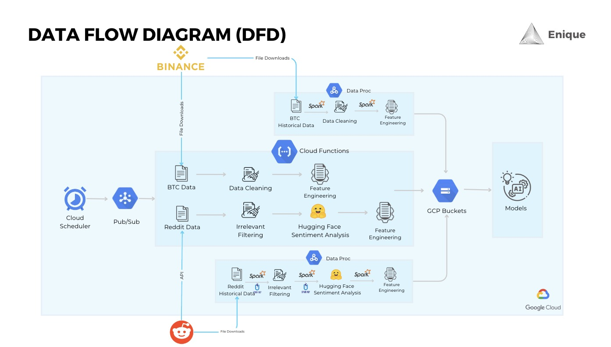

  

<h1 align="center">

<a href="https://eniquego.com/">Autonomous Investment Advisor</a>

</h1>

Enique is a conversational AI investment advisor integrated with a proprietary price prediction model. Enique runs autonomously in real-time.

- TODO screenshot of UI
  
## Problem Statement
**Background**: Retail investors often need more practical guidance on making short-term profits from Bitcoin than traditional investment assets. Bitcoin Financial Advisor services can address this need by extracting prediction signals from Reddit data and customizing recommendations to investors' dynamic needs.

- **Target Audience**: Enique focuses on individuals who may not have substantial savings but are eager to generate passive income to enjoy life's simple pleasures.
- **Market Insight**: Two-thirds of the population invests in the markets, yet navigating the financial landscape is daunting and time-consuming—even for industry professionals.
-**Challenges**: Outsourcing financial advice is costly and largely inaccessible to our target users. Additionally, playing the safe, conservative long game does not yield significant immediate-term profits, which is a primary concern for our audience.

**Solution**: Enique's business value begins by addressing these pain points.

## Business Value

    
 

 
- **Superior Autonomy**: Enique’s capabilities surpass those of typical human investment advisors.
  - Human investment advisors provide financial guidance based on standardized strategies and second-hand research. They cannot customize or generate ad-hoc analyses upon request. Additionally, their fee structures often must be revised for individuals with smaller deposits.
- **Customized Strategies**: Enique delivers specific investment strategies based on its proprietary market predictions.
Plug-and-Play Tool: Enique can seamlessly integrate any in-house proprietary prediction model, enhancing offerings for downstream clients.

**Illustrative Example:**

- Our team has developed a Bitcoin prediction model integrated as the default within Enique. More details on this feature will be provided later.

**Key Features:**

- Enique performs bespoke research on-the-fly, leveraging its computational power to address client queries immediately.
- Enique’s prediction models adapt in real time by directly integrating live data.
- Enique is available 24/7, with no fees, and is deposit size agnostic, making it accessible to all income levels.

These business values create earning opportunities, foster intellectual growth, and are cost-efficient in terms of money and time.

**Motto:**
- More earning and learning; less spending and tending.

## Technical Sophistication and Efficiency

  
###  Data and Processing Overview

- **Data Sources**:
  - **Bitcoin Market Data**: Sourced from Binance, including prices and trade volume.
  - **Reddit Blog Posts**: Sourced to proxy sentiment for our prediction model.

#### Data Ingestion and Processing:
- **Bitcoin Data**: Prices and trade volume are ingested hourly, cleaned, and processed.
- **Reddit Data**:
  - Reddit API limits pull to the last 1000 observations. As post reactions such as upvotes, downvotes, and comments change over time, our API pulls data every fifteen minutes.
  - Processing logic updates overlapping Reddit data with the latest reaction metrics.
  - Focuses on text submissions from the subreddit “r/bitcoin,” excluding gifs, videos, and links.

    
 

##### Sentiment Analysis:

Data is cleaned and filtered through zero-shot learning.
Reddit posts are processed using a pre-trained three-category sentiment model to assign positive, negative, and neutral sentiment scores, creating unique features.

##### Data Management:

<table class="tg"><thead>
  <tr>
    <th class="tg-1wig">Scheduler Name</th>
    <th class="tg-1wig">Frequency</th>
    <th class="tg-1wig">Cron Format</th>
    <th class="tg-1wig">Note</th>
  </tr></thead>
<tbody>
  <tr>
    <td class="tg-0lax">get-reddit-data</td>
    <td class="tg-0lax">Every 15 mins</td>
    <td class="tg-0lax">*/15 * * * *</td>
    <td class="tg-0lax">
      1. Get and save the raw data;  
      2. Add md5(content)  
      3. Set secret key as an env variable of get-reddit-data-func   

   </td>
  </tr>
  <tr>
    <td class="tg-0lax">discard-irrelevant-data</td>
    <td class="tg-0lax">Every 30 mins</td>
    <td class="tg-0lax">*/30 * * * *</td>
    <td class="tg-0lax">Combine reddit data, and conduct irrelevancy analysis</td>
  </tr>

  <tr>
    <td class="tg-0lax">sentiment-analysis</td>
    <td class="tg-0lax">Every 30 mins</td>
    <td class="tg-0lax">*/30 * * * *</td>
    <td class="tg-0lax">Sentiment analysis</td>
  </tr>
  <tr>
    <td class="tg-0lax">get-btc-data</td>
    <td class="tg-0lax">Every 1 hour</td>
    <td class="tg-0lax">0 * * * *</td>
    <td class="tg-0lax">Get BTC data from Binance</td>
  </tr>
  <tr>
    <td class="tg-0lax">process-btc-data</td>
    <td class="tg-0lax">Every 1 hour</td>
    <td class="tg-0lax">0 * * * *</td>
    <td class="tg-0lax">Calculate all the indicators and other features for modeling</td>
  </tr>
  <tr>
    <td class="tg-0lax">get-rep-posts</td>
    <td class="tg-0lax">Every 30 mins</td>
    <td class="tg-0lax">*/30 * * * *</td>
    <td class="tg-0lax">Get representative posts</td>
  </tr>
  <tr>
    <td class="tg-0lax">get-senti-indicators</td>
    <td class="tg-0lax">Every 30 mins</td>
    <td class="tg-0lax">*/30 * * * *</td>
    <td class="tg-0lax">Calculate sentiment indicators</td>
  </tr>
</tbody></table>

- A cloud scheduler regulates the live data process.
- Historical Data:
  - Bitcoin trade data (last five years, approx. 9.7 MB) and Reddit data (approx. 2.4 TB) are processed using Spark to handle large data sizes.

##### Storage and Scalability:
- All processed data is stored in Google Cloud Storage Buckets.
- Designed for scalability and flexibility to integrate new enhancements and additional data sources.
- Capable of extracting trend analytics and enriching prediction model inputs to expand advisory offerings.
- Flexible enough to integrate with third-party models for easy platform integration.

### Data Trend

- **Exploratory Analysis:**
  - We conducted an extensive exploratory analysis available in our GitHub repository. We will keep it brief here to maintain your interest.
  - Across our Reddit data, blog post frequency was predictably higher during "normal business" hours, with a notable local spike at 2 am. This spike is likely due to nocturnal users like people sacrificing sleep for late-night exploration.

- **Comparison with Bitcoin Trading Volume:**
  - Comparing the shape of Reddit post activity to the average Bitcoin trade volume bar chart (top right in purple), we observe a significant overlap in Bitcoin trading volume (also shown in purple).
  - This comparison is a basic sanity check if we use Reddit data to build sentiment signals for predicting Bitcoin prices.

- **Bitcoin vs. S&P500 Trading Volumes:**
  - Bitcoin trading volumes, compared to S&P500-related trading volumes shown in red, indicate that Bitcoin does not follow traditional market open and close concentrations.

- **Earnings Opportunity:**
  - The final chart (bottom right) demonstrates that the earnings opportunity for Bitcoin is much more significant due to its higher volatility. However, the risk-adjusted returns could be more attractive.
  - These data ingredients offer pretty exciting insights.

----------

### Model Architecture

    
 

 

    
 

 

    
 

 
## Reproducibility

### Package Requirements

-   OS: Debian 11
-   Python: 3.10.14; 3.11.2
-   Numpy: 1.25.2
-   Sklearn: 1.3.0
-   Tensorflow: 2.13.0; 2.14.0
-   Keras: 2.8; 2.14.0
-   Hadoop 3.3
-   Spark 3.3
-   Spark-nlp: 4.2.0
-   Prophet: 1.1.5

## Future Work

- Data Enrichment
  - Traditional - SPX, VIX, MOVE;
  - Blockchain - ledger, mining; and,
  - Asset adoption - legal landscape

- Sharpen Prediction
    - Bias prediction errors to reflect loss aversion.
    - Model tuning.
    - LSTM layer complexity.
      
- Scope Expansion
  - RAG for humanizing and outside data-source retrieval.

## Our Team

    
 

